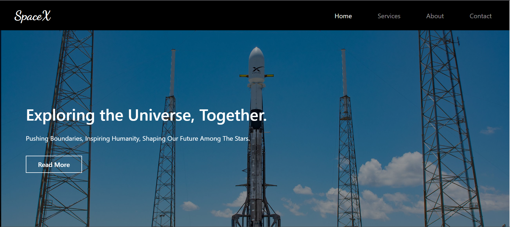
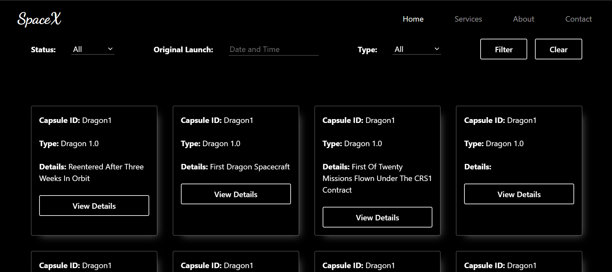

<!-- Improved compatibility of back to top link: See: https://github.com/Shahil9728/Brainstorm-Assignment/ -->

<!-- PROJECT LOGO -->
 

  

  <h3 align="center"><a href="https://spacex9.netlify.app/" target="_blank">SpaceX</a></h3>
  

     
     
    <a href="https://github.com/Shahil9728/Brainstorm-Assignment/issues">Report Bug</a>
    ·
    <a href="https://github.com/Shahil9728/Brainstorm-Assignment/issues">Request Feature</a>
  

### TutoTube

### Project Link: [https://spacex9.netlify.app/](https://spacex9.netlify.app/)
Must visit it for better view !🥰 

### Introduction

Welcome to SpaceX! Our website is a stunning platform that features an impressive collection of rockets from various space agencies and private companies worldwide. Created using React and Material UI, our user-friendly interface allows you to explore the latest and historic rockets in exquisite detail. We source our data through APIs, ensuring accurate and up-to-date information. From Falcon 9 to Saturn V, embark on an educational journey, exploring the technology, specifications, and missions behind each rocket. Whether you're a space enthusiast or a curious learner, Rocket Showcase offers an immersive experience that will ignite your passion for space exploration.

<!-- IMAGES -->
### WEBSITe SCREENSHOTS

 

### Built With

This section lists about the languages used in this project .

* 
* 

 

(<a href="#readme-top">back to top</a>)

<!-- CONTACT -->
## Contact

Your Name - [@Shahil9728](https://twitter.com/ShahilV27515989) - shahilverma91383@gmail.com

Project Link: [https://spacex9.netlify.app/](https://spacex9.netlify.app/)

(<a href="#readme-top">back to top</a>)

